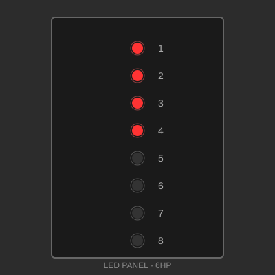

# Panel Gallery

Welcome to the Makerpanel gallery! Browse community-contributed panel designs, download files, and get inspired for your next project.

## How to Use This Gallery

Each panel listing includes:

- **Thumbnail**: Visual preview of the panel
- **Size**: Dimensions in HP (horizontal pitch) and U (rack units)
- **Description**: Brief overview of the panel's purpose
- **Details Link**: Link to full specifications, files, and assembly instructions

## Contributed Panels

---

### Basic Potentiometer Panel

{ width="200" }

**Size**: 8 HP × 3U  
**Type**: Analog Control  
**Contributor**: Ranch Hand Robotics

A simple panel featuring four potentiometers for analog control applications. Ideal for audio mixing, motor control, or general parameter adjustment.

[View Details →](panels/pot-panel.md){ .md-button }

---

### LED Indicator Panel

{ width="200" }

**Size**: 6 HP × 3U  
**Type**: Visual Feedback  
**Contributor**: Ranch Hand Robotics

Eight LED indicators arranged in a vertical array. Perfect for status monitoring, VU meters, or sequential displays.

[View Details →](panels/led-panel.md){ .md-button }

---

### USB Hub Panel

{ width="200" }

**Size**: 12 HP × 3U  
**Type**: Connectivity  
**Contributor**: Ranch Hand Robotics

Front-panel USB hub with four USB-A ports and two USB-C ports. Integrated power management and status LEDs.

[View Details →](panels/usb-panel.md){ .md-button }

---

## Contributing Your Panel

Have you designed a Makerpanel-compatible panel? We'd love to add it to the gallery!

See the [Contributing Guide](contributing.md) for instructions on how to submit your panel design.

## Gallery Statistics

- **Total Panels**: 3
- **Contributors**: 1
- **Categories**: Analog Control, Visual Feedback, Connectivity

---

## Browse by Category

=== "Analog Control"
    - [Basic Potentiometer Panel](panels/pot-panel.md) - 8 HP × 3U

=== "Visual Feedback"
    - [LED Indicator Panel](panels/led-panel.md) - 6 HP × 3U

=== "Connectivity"
    - [USB Hub Panel](panels/usb-panel.md) - 12 HP × 3U

=== "Digital I/O"
    *No panels yet - be the first to contribute!*

=== "Audio"
    *No panels yet - be the first to contribute!*

=== "Power"
    *No panels yet - be the first to contribute!*

---

## Panel Design Tools

### Recommended Software

- **2D Design**: Inkscape, Adobe Illustrator, or FreeCAD
- **3D Modeling**: FreeCAD, Fusion 360, or OpenSCAD
- **PCB Design**: KiCad, Eagle, or EasyEDA
- **Panel Layout**: Front Panel Designer, Front Panel Express

### Templates

Starter templates to speed up your panel design are coming soon!

---

**Last Updated**: January 2026  
**Questions?** Check the [Contributing Guide](contributing.md) or open an issue on [GitHub](https://github.com/Ranch-Hand-Robotics/makerpanel).
