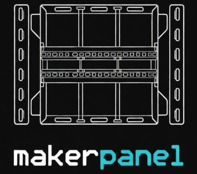

---
hide:
  - navigation
  - toc
title: " "
---

<!-- Copyright (c) 2025 Ranch Hand Robotics, LLC. All rights reserved. Licensed under MIT License. -->

  

    

      
    

    

      Open specification and gallery for modular maker panels
    

    

      <a href="gallery.html" class="hero-btn-primary" style="background: #4a9d5f; color: #ffffff; padding: 1rem 2.5rem; border-radius: 0.25rem; text-decoration: none; font-weight: 900; font-size: 1.1rem; display: inline-block; transition: all 0.3s ease; border: 2px solid #4a9d5f; text-transform: uppercase; letter-spacing: 0.1em;">
        > Browse Gallery
      </a>
      <a href="https://github.com/Ranch-Hand-Robotics/makerpanel/issues/new?template=submit-panel.yml" class="hero-btn-secondary" style="background: transparent; color: #4a9d5f; padding: 1rem 2.5rem; border-radius: 0.25rem; text-decoration: none; font-weight: 900; font-size: 1.1rem; display: inline-block; border: 2px solid #4a9d5f; transition: all 0.3s ease; text-transform: uppercase; letter-spacing: 0.1em;">
        + Submit Panel
      </a>
    

  

## What is Makerpanel?

Makerpanel is an open specification for creating **modular control panels** for makers, DIY enthusiasts, and electronics projects. Based on the Eurotrack synthesizer standard but adapted with **standard T-slot rails** for universal mounting, Makerpanel provides a flexible system for building custom control interfaces.

## Key Features

  

    
🔧

    <h3 style="margin-top: 0; color: #4a9d5f; font-size: 1.2rem; position: relative; z-index: 1; text-transform: uppercase; letter-spacing: 0.05em;">Flexible</h3>
    
Uses T-slot rails with M5/M6 twist nuts for tool-free mounting

  

  

    
🧩

    <h3 style="margin-top: 0; color: #4a9d5f; font-size: 1.2rem; position: relative; z-index: 1; text-transform: uppercase; letter-spacing: 0.05em;">Modular</h3>
    
Mix and match panels for your specific needs

  

  

    
🌟

    <h3 style="margin-top: 0; color: #4a9d5f; font-size: 1.2rem; position: relative; z-index: 1; text-transform: uppercase; letter-spacing: 0.05em;">Community</h3>
    
Open specification allowing anyone to design and share panels

  

