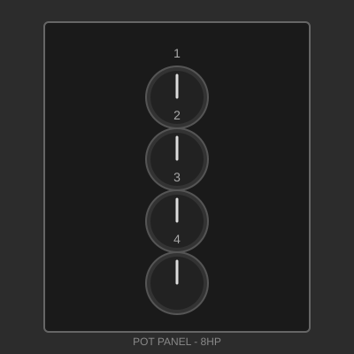

<!-- Copyright (c) 2025 Ranch Hand Robotics, LLC. All rights reserved. Licensed under MIT License. -->

---
title: Basic Potentiometer Panel
category: Analog Control
size: 8 HP × 3U
contributor: Ranch Hand Robotics
thumbnail: images/thumb.svg
description: A simple panel featuring four potentiometers for analog control applications. Ideal for audio mixing, motor control, or general parameter adjustment.
---

# Basic Potentiometer Panel



## Overview

A versatile analog control panel featuring four high-quality rotary potentiometers. Perfect for audio mixing, motor speed control, parameter adjustment, or any application requiring analog input.

## Specifications

- **Size**: 8 HP × 3U (40.64 mm × 128.5 mm)
- **Depth**: 35 mm (including potentiometers)
- **Material**: Aluminum (2mm thickness)
- **Finish**: Black anodized
- **Power Requirements**: None (passive)
- **Mounting**: T-slot compatible with 4 mounting points (M5/M6 twist nuts)

## Features

- Four independent 10kΩ linear potentiometers
- Standard 6mm shaft with knurled split shaft
- PCB-mount or panel-mount options
- Clear numbered labeling (1-4)
- Gold-plated contacts for reliability
- Smooth rotation with detent option available

## Design Files

*Design files will be available soon. This is an example panel for demonstration.*

Example file structure:
- Mechanical Drawing (DXF)
- 3D Model (STEP)
- Assembly Instructions (PDF)

## Bill of Materials

| Qty | Part | Description | Approx. Cost |
|-----|------|-------------|--------------|
| 1 | Panel | Aluminum 2mm, 8HP×3U, anodized | $15.00 |
| 4 | Potentiometer | 10kΩ linear, PCB mount | $8.00 |
| 4 | Knob | 20mm diameter, aluminum | $12.00 |
| 4 | M3 Screw | 8mm length, countersunk | $1.00 |
| 4 | T-slot T-nut | M5/M6 compatible with rail system | $2.00 |
| 1 | Connector | 6-pin JST or screw terminal | $2.00 |

**Total Estimated Cost**: ~$40.00

## Wiring

```
Pin 1: Ground
Pin 2: +V (Potentiometer supply voltage)
Pin 3: Pot 1 Wiper
Pin 4: Pot 2 Wiper
Pin 5: Pot 3 Wiper
Pin 6: Pot 4 Wiper

Note: All potentiometers share common ground and +V connections
Typical +V supply: 3.3V or 5V depending on your ADC
```

## Assembly Instructions

1. **Panel Preparation**
   - Verify all holes are deburred and clean
   - Check fit with T-slot rail before proceeding

2. **Install Potentiometers**
   - Insert potentiometers from front of panel
   - Secure with mounting nuts (hand-tight, then 1/4 turn)
   - Ensure all pots are aligned vertically

3. **Wiring**
   - Connect all ground terminals together
   - Connect all +V terminals together
   - Run wiper connections to connector
   - Use heat shrink on exposed connections

4. **Install Knobs**
   - Align knob indicator to 12 o'clock position
   - Tighten set screw

5. **Mounting**
   - Install T-slot twist nuts (M5/M6) in panel mounting slots
   - Position panel on rail
   - Insert and tighten M3 mounting screws
   - Verify panel is secure and aligned

## Applications

- **Audio**: Volume, tone, pan, or effect controls
- **Lighting**: Dimmer controls for multiple channels
- **Motor Control**: Speed or position adjustment
- **Robotics**: Manual control of servo positions
- **Home Automation**: Scene brightness or temperature control

## Variations

This design can be easily adapted:

- **Different Values**: Use 1kΩ, 100kΩ, or logarithmic taper pots
- **Panel Size**: Scale to 4 HP (2 pots) or 12 HP (6 pots)
- **Rotary Encoders**: Replace pots with digital encoders
- **Integrated PCB**: Add buffer or amplifier circuitry

## License

This design is released under the **MIT License**.

Permission is hereby granted, free of charge, to use, copy, modify, and distribute this design for any purpose.

## Author

**Ranch Hand Robotics**  
GitHub: [@Ranch-Hand-Robotics](https://github.com/Ranch-Hand-Robotics)  
Date: January 2026

---

[← Back to Gallery](../../gallery.md)
