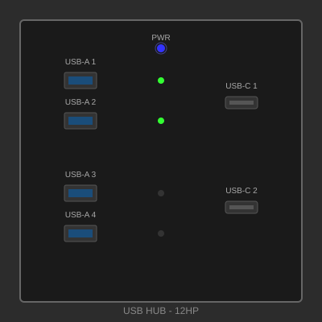

# USB Hub Panel

## Overview

A front-panel USB hub providing convenient access to USB connectivity in your Makerpanel setup. Features four USB-A 3.0 ports and two USB-C ports with integrated power management and status indicators. Perfect for connecting peripherals, development boards, or charging devices.

## Specifications

- **Size**: 12 HP × 3U (60.96 mm × 128.5 mm)
- **Depth**: 55 mm (including PCB and connectors)
- **Material**: FR4 PCB with aluminum faceplate
- **Finish**: Black anodized aluminum, black PCB
- **Power Requirements**: 12V DC input, 5V/3A output via onboard regulator
- **Data Interface**: USB 3.0 (backward compatible with USB 2.0)
- **Mounting**: M-LOK compatible with 4 mounting points

## Features

- Four USB-A 3.0 ports (5 Gbps data transfer)
- Two USB-C ports with USB PD support (USB 2.0 data)
- Individual overcurrent protection per port
- Status LED for each port (green = active, red = fault)
- Main power indicator LED
- Upstream USB-C connection to host
- ESD protection on all data lines
- Resettable fuses for safety
- Hot-plug capable

## Design Files

*Design files will be available soon. This is an example panel for demonstration.*

Example file structure:
- PCB Gerber Files (ZIP)
- Schematic (PDF/KiCad)
- 3D Model (STEP)
- Faceplate Design (DXF)
- BOM with part numbers (CSV)

## Bill of Materials

| Qty | Part | Description | Approx. Cost |
|-----|------|-------------|--------------|
| 1 | PCB | FR4 1.6mm, 12HP×3U, 4-layer | $15.00 |
| 1 | Faceplate | Aluminum 2mm, laser cut | $18.00 |
| 4 | USB-A Connector | USB 3.0 Type A receptacle | $8.00 |
| 2 | USB-C Connector | USB Type C receptacle | $6.00 |
| 1 | USB Hub IC | USB 3.0 hub controller (e.g., GL3523) | $5.00 |
| 1 | DC-DC Converter | 12V to 5V, 3A | $4.00 |
| 6 | Resettable Fuse | 500mA, SMD | $3.00 |
| 7 | LED | 0805 SMD, bi-color (red/green) | $2.00 |
| 1 | Upstream Cable | USB-C to internal header | $3.00 |
| 4 | M3 Screw | 10mm length, countersunk | $1.00 |
| 4 | M-LOK T-nut | Compatible with rail system | $2.00 |
| - | Passives | Resistors, capacitors, etc. | $5.00 |

**Total Estimated Cost**: ~$72.00

## Power Specifications

**Input**: 12V DC, 0.5A (6W maximum)  
**Output**: 5V DC, 3A total (distributed across ports)  
**Per Port Limit**: 500mA (USB 3.0 standard)

**Protection**:
- Overcurrent protection per port
- Reverse polarity protection on input
- ESD protection on all USB data lines
- Thermal shutdown on voltage regulator

## Technical Details

### USB Hub Controller
- Supports USB 3.0 SuperSpeed (5 Gbps)
- Backward compatible with USB 2.0/1.1
- 4 downstream USB 3.0 ports
- Built-in transaction translator
- Link power management (LPM) support

### USB-C Ports
- USB 2.0 data only (480 Mbps)
- CC resistor configuration for proper orientation
- Can provide charging up to 500mA per port
- USB PD negotiation for compatible devices

## LED Indicators

Each port has a dual-color LED:
- **Green**: Port active, normal operation
- **Red**: Overcurrent fault detected
- **Off**: No device connected

Main panel LED:
- **Blue**: Panel powered and operational
- **Off**: No power to panel

## Assembly Instructions

1. **PCB Assembly**
   - This panel requires SMD assembly (recommend professional PCBA service)
   - Or use reflow oven/hot plate for DIY assembly
   - Double-check USB connector orientations
   - Test continuity before applying power

2. **Initial Testing**
   - Connect 12V power only (no upstream USB)
   - Verify 5V rail with multimeter
   - Check main power LED illuminates
   - Verify no excessive heat from regulator

3. **USB Testing**
   - Connect upstream USB-C to host computer
   - Verify hub enumeration in device manager
   - Test each port with a USB device
   - Verify LEDs indicate correct status

4. **Faceplate Installation**
   - Align faceplate over USB connectors
   - Ensure proper fit before securing
   - Secure with M3 screws from back

5. **Panel Mounting**
   - Install M-LOK T-nuts
   - Position on rail, ensuring clearance for cables
   - Tighten mounting screws
   - Connect power and upstream USB

## Wiring

**Power Input** (2-pin connector):
- Pin 1: +12V
- Pin 2: Ground

**Upstream USB** (internal USB-C cable):
- Connect to host system's USB port
- Or use internal header if available

## Applications

- **Development Station**: Easy access for programming dev boards
- **3D Printer Panel**: Connect camera, WiFi adapter, USB drive
- **Audio Workstation**: Connect MIDI controllers, audio interfaces
- **Home Automation**: Connect Zigbee/Z-Wave controllers
- **General Maker Station**: Convenient port access for any USB device

## Usage Notes

- Maximum 3A total current across all ports
- Individual ports limited to 500mA (USB 3.0 spec)
- For higher power devices, use dedicated power supply
- USB-C ports can charge phones/tablets at standard rates
- Overcurrent protection auto-recovers when fault cleared

## Firmware

The USB hub controller operates with factory firmware. No user programming required.

## Troubleshooting

**Hub not detected**:
- Check upstream USB connection
- Verify 12V power supply is connected
- Check main power LED

**Port not working**:
- Check port LED status
- Red LED indicates overcurrent - disconnect device
- Try different USB device to verify

**Slow transfer speeds**:
- Verify USB 3.0 cable used for upstream connection
- Some devices may negotiate USB 2.0 speed
- Check host system supports USB 3.0

## Variations

- **Higher Power**: Use larger DC-DC converter for 5A output
- **More Ports**: Cascade hub ICs for 8+ ports
- **All USB-C**: Replace USB-A with all USB-C ports
- **Isolated Ports**: Add USB isolators for sensitive applications
- **Ethernet**: Add USB-to-Ethernet adapter on internal port

## License

This design is released under the **MIT License**.

Permission is hereby granted, free of charge, to use, copy, modify, and distribute this design for any purpose.

## Author

**Ranch Hand Robotics**  
GitHub: [@Ranch-Hand-Robotics](https://github.com/Ranch-Hand-Robotics)  
Date: January 2026

---

[← Back to Gallery](../gallery.md)
